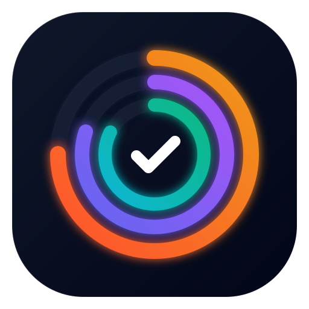
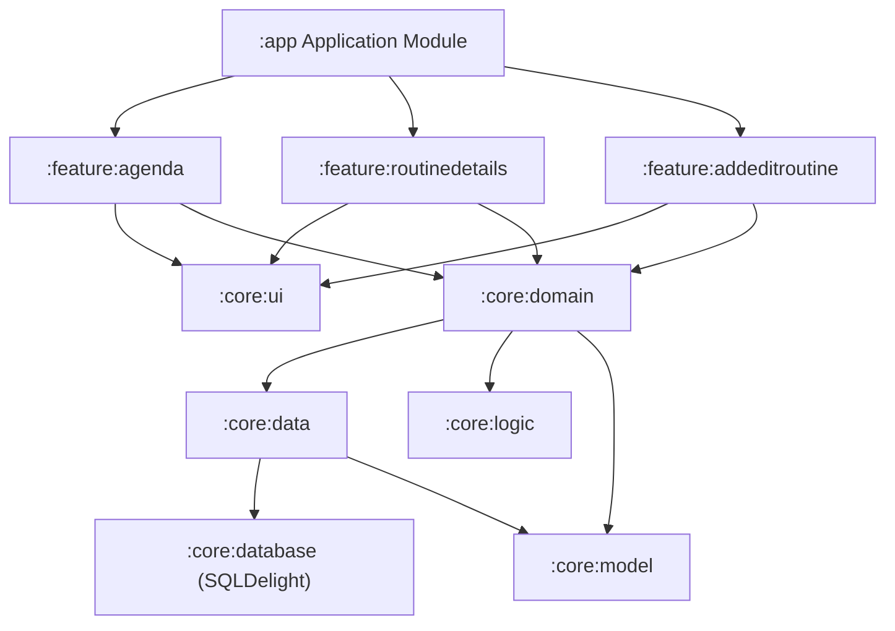

<div align="center">

# 🌊 RoutineFlow

**A Modern, Adaptive Habit Tracker & Daily Routine Planner for Android**  
*Intelligent Schedules • Rolling Consistency Analytics • Streak Milestones • Micro-Interaction Celebrations*

<br />



<br />
<br />

[](https://github.com/AizenIndex/RoutineFlow/releases/latest)
[](https://github.com/AizenIndex/RoutineFlow/releases/download/v1.0.0/RoutineFlow-v1.0.0.apk)
[](LICENSE)
[](https://kotlinlang.org)
[](https://developer.android.com/jetpack/compose)
[-3DDC84?logo=android&logoColor=white)](https://android.com)

</div>

<br />

---

## 📑 Table of Contents
- [📥 Download & Releases](#-download--releases)
- [🌟 What is RoutineFlow?](#-what-is-routineflow)
- [✨ Key Features](#-key-features)
- [📱 Feature Showcase](#-feature-showcase)
- [🏗️ Architecture & Tech Stack](#️-architecture--tech-stack)
- [🚀 Building from Source](#-building-from-source)
- [📜 Attribution & License](#-attribution--license)

---

## 📥 Download & Releases

You can install RoutineFlow directly on your Android device without needing the Google Play Store:

### 📦 Latest Release: **[v1.0.0](https://github.com/AizenIndex/RoutineFlow/releases/tag/v1.0.0)**

| File | Type | Download Link |
| :--- | :--- | :--- |
| **`RoutineFlow-v1.0.0.apk`** | Android Application Package | [⬇️ **Download APK**](https://github.com/AizenIndex/RoutineFlow/releases/download/v1.0.0/RoutineFlow-v1.0.0.apk) |
| **Source Code** | Archive (`.zip` / `.tar.gz`) | [📦 **GitHub Release Page**](https://github.com/AizenIndex/RoutineFlow/releases/tag/v1.0.0) |

> **💡 How to Install:**
> 1. Download `RoutineFlow-v1.0.0.apk` to your Android phone.
> 2. Open the file from your downloads folder.
> 3. If prompted, enable *"Install from unknown sources"* for your browser/file manager.
> 4. Tap **Install** and launch RoutineFlow!

---

## 🌟 What is RoutineFlow?

Most habit trackers punish you harshly with broken streaks whenever life gets in the way. **RoutineFlow** is built on a fundamentally smarter principle: **Adaptive Habit Tracking**.

It combines a clean calendar agenda with an intelligent scheduling engine that understands real human life. Whether you track habits daily, 3 times a week on flexible days, or monthly goals, RoutineFlow accounts for non-due days, allows you to clear backlogs flexibly, and gives you deep visibility into your long-term consistency.

---

## ✨ Key Features

### 📊 1. Consistency Analytics & Streak Milestones *(New)*
- **Rolling Consistency Score**: Real-time calculated consistency rate percentage and animated progress indicator for every habit.
- **Streak Milestone Badges**: Unlock milestones as your consistency builds:
  - 🥉 **7-Day Bronze Champion**
  - 🥈 **30-Day Silver Master**
  - 🥇 **100-Day Gold Legend**
- **Comprehensive Statistics**: Detailed breakdown of active streaks, longest historical streak, and total completed sessions.

### 🎆 2. Habit Completion Celebrations *(New)*
- **Micro-Interaction Particle FX**: 60-FPS fluid particle burst celebration when checking off routines in your daily agenda.
- **Dopamine-Positive Feedback**: Instant visual reward designed to build positive habit loops.

### 🔄 3. Adaptive Scheduling Engine
- **Intelligent Backlog Management**: Missed a habit? RoutineFlow suggests resolving your backlog on the next non-due day without breaking your streak.
- **Over-Completion Balancing**: Completed a routine ahead of schedule? Next planned sessions automatically balance out.
- **Flexible Frequencies**: Full support for daily, weekly (any days or specific days of week), monthly, and alternate-day intervals.

### 📅 4. Agenda & Calendar Integration
- **Clean Agenda View**: Distraction-free daily task lists for any selected date.
- **Long-term Planning Calendar**: Visual calendar displaying completions, streaks, and future planning dates.

### 🎨 5. Modern Jetpack Compose UI
- **Material You Design**: Full Material 3 theming with dynamic color palette support on Android 12+.
- **Pure Dark Mode**: Sleek dark slate and OLED high-contrast aesthetics.
- **Landscape & Tablet Support**: Optimized multi-column layout for tablets and landscape mode.

### 🔒 6. 100% Offline & Private
- **Zero Tracking**: No telemetry, no third-party analytics, no tracking SDKs.
- **No Account Required**: Works completely offline. Your confidential habit data never leaves your device.
- **100% Free**: No subscriptions, no ads, and fully open-source under GPL v3.

---

## 📱 Feature Showcase

| Agenda View | Flexible Schedules | Habit Customization |
| :---: | :---: | :---: |
|  |  |  |
| *Clean daily agenda with dynamic calendar bar* | *Adaptive weekly, monthly, and daily rules* | *Personalized targets, streak goals, and notifications* |

---

## 🏗️ Architecture & Tech Stack

RoutineFlow is engineered following Google's **Now In Android** modularization standards and **CLEAN Architecture** principles:



### Core Technologies:
* **UI**: 100% [Jetpack Compose](https://developer.android.com/jetpack/compose) with Material 3 (Single Activity, zero Fragments).
* **Architecture**: MVVM + CLEAN with Repository and Use-Case patterns.
* **Dependency Injection**: [Koin](https://insert-koin.io/) (configured for seamless Kotlin Multiplatform expansion).
* **Database**: [SQLDelight](https://cashapp.github.io/sqldelight/) for local SQLite storage with Flow extensions.
* **Asynchronous Streams**: Kotlin Coroutines & `StateFlow`.
* **Date & Time Engine**: `kotlinx-datetime` and `com.kizitonwose.calendar`.
* **Build System**: Gradle multi-module build with custom convention plugins in `build-logic`.

---

## 🚀 Building from Source

### Prerequisites:
- **Android Studio**: Koala / Ladybug (2024.1+) or newer
- **JDK**: Java 17 or Java 21
- **Android SDK**: API level 34+ (minSdk 26)

### Steps:
1. **Clone the repository:**
   ```bash
   git clone https://github.com/AizenIndex/RoutineFlow.git
   cd RoutineFlow
   ```

2. **Open in Android Studio:**
   Open the root project folder in Android Studio and let Gradle sync dependencies.

3. **Build and install debug APK:**
   ```bash
   ./gradlew :app:assembleMinSdk26Debug
   ```
   The APK binary will be generated at `app/build/outputs/apk/minSdk26/debug/`.

---

## 📜 Attribution & License

> [!IMPORTANT]  
> **RoutineFlow** is an open-source evolution and modernized fork based on [RoutineTracker](https://github.com/DanielRendox/RoutineTracker) created by **[Daniel Rendox](https://github.com/DanielRendox)**.  
> We gratefully acknowledge and credit Daniel Rendox for the foundational scheduling concepts and clean architecture design.

### License
This project is licensed under the **GNU General Public License v3.0 (GPL v3)**.  
You are free to use, modify, and distribute this software under the same license. See the [LICENSE](LICENSE) file for complete terms.
